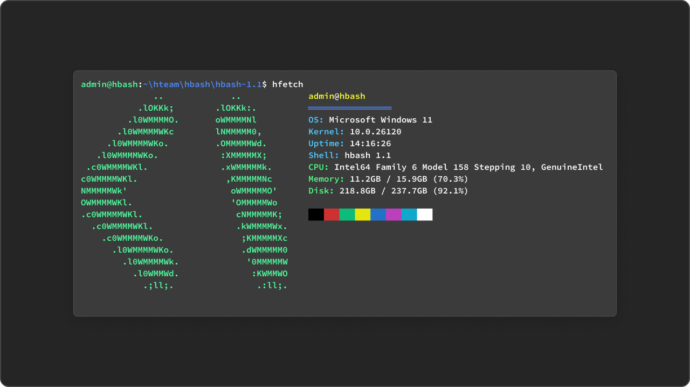
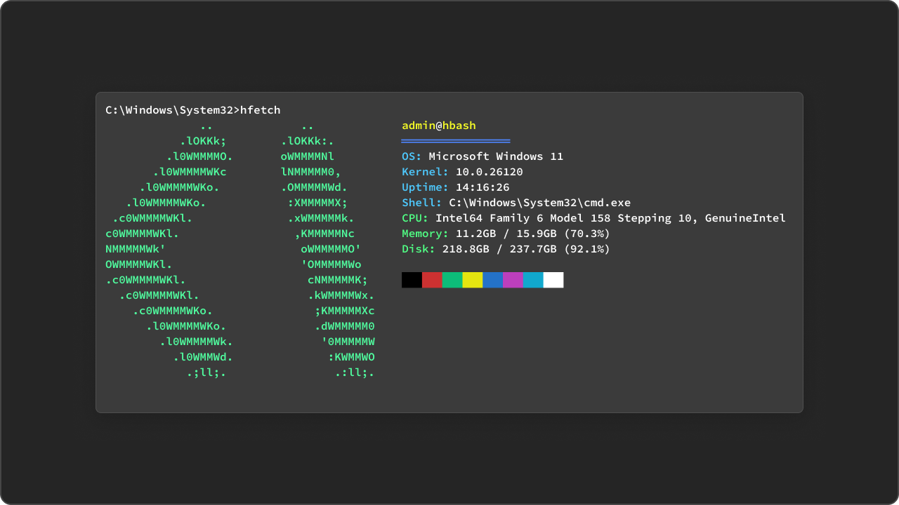

# hfetch

A utility that shows all the current system information about your PC.

## Installation

1. Clone the repository:
```bash
git clone <repository-url>
cd hfetch
```

2. Install using pip:
```bash
pip install .
```

or:
```bash
pip install -r requirements.txt
```

## Usage

Simply run:
```bash
python hfetch.py
```

Or after installation:
```bash
hfetch
```

## Options

- `-v, --version`: Show version
- `-h, --help`: Show help

## An example of how the utility works


Working on [hbash](https://github.com/hentai-team/hbash) `1.1-beta`.


Working on Windows 11 (cmd.exe).

## License

This project is licensed under the MIT License. See the [LICENSE](LICENSE) file for details.